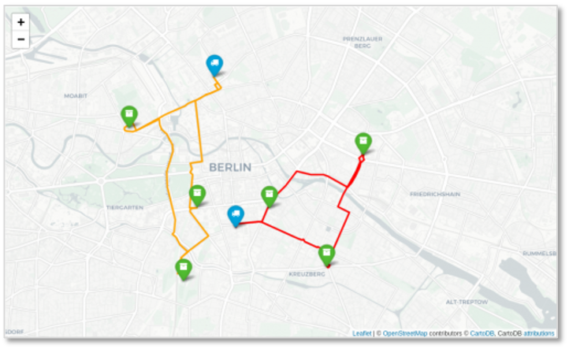

# What is openrouteservice?

- openrouteservice is an **open-source routing engine based on open data from OpenStreetMap.**
- Based on the open-source routing engine [GraphHopper](www.graphhopper.com)
- Focus on specialized routing applications in humanitarian aid, health and environment

[comment]: # (|||)

### Directions 

It **calculates routes from A to B** using different modes of transport such as pedestrian, bike, car or wheelchair 

</img>

[comment]: # (|||)

### Isochrones 

Calculate the area which is reachable within a certain time frame or distance to perform **reachability analyses**, e.g. analyse [health care access](../usecases/health_access.md).

</img>

[comment]: # (|||)

### Matrix 

Calculate **travel times or distances between several locations at once** to solve logistic problems  

</img>

[comment]: # (|||)

### Optimization 

Solve vehicle routing problems such as the **traveling salesman problem** using optimization endpoint!

</img>

[comment]: # (|||)

In addition to there navigation services, openrouteservice helps in **finding geolocations of addresses** (geocoding), returns **Points-of-Interests** around a given location and **elevation profiles** along a route. 

[comment]: # (|||)

## But openrouteservice is not just an engine!

There is a large **ecosystem of services and clients** built around the core routing engine to support its users in integrating openrouteservice into their projects.

[comment]: # (|||)

## A brief history of openrouteservice

openrouteservice was started in 2008 by the GIScience Research Group (Prof. Alexander Zipf) at Heidelberg University. Within research projects, openrouteservice engine was extended to support more specialized applications such as wheel chair routing or [healthy routing](../usecases/green_routing.md). Since 2017, openrouteservice is mainly developed and maintained by the [HeiGIT gGmbH](www.heigit.org), which was founded by Alexander Zipf. Since then the GIScience Research Group and HeiGIT work closely together to further extend openrouteservice capabilities to support actions in humanitarian aid, environment and health.   

[comment]: # (|||)

## Who uses openrouteservice?

Over the years more and more users joined from a variety of countries, backgrounds and organisations.  

</img>

