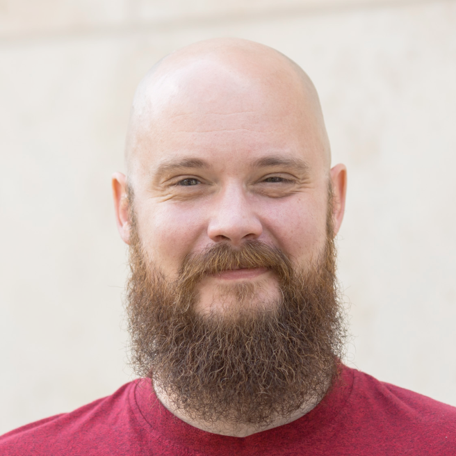
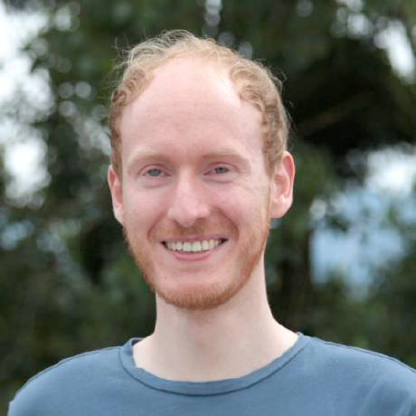
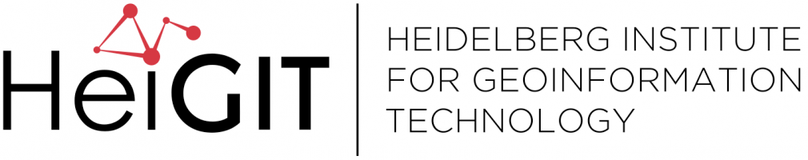
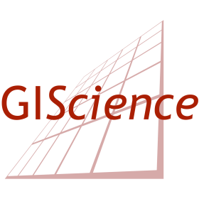
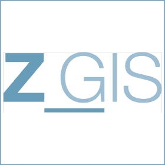
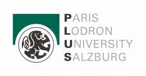

# Open data and methods for assessing active mobility options: Routing in the context of bikeability and walkability

Welcome to this tutorial at AGILE 2024 about walk and bikeability, and how you can use some open source tools and 
data to assess this information. 

This tutorial is split into several parts. In the sections [OpenStreetMap](./openstreetmap/intro.md), 
[openrouteservice](./openrouteservice/01_what.md) and [NetAScore](./netascore/intro.md), you can find some general 
information about the data and tools that we will be using. The practical part of the tutorial can be found in the 
[Tutorial](./tutorial/tutorial.md) section, which is made up of guided tutorials on how to use these tools and data in 
the context of walk and bikeability. Feel free to tackle these individual tutorials in any order, though the 
integration one assumes that you have completed at least the [NetAScore](./tutorial/netascore.md) and 
[openrouteservice](./tutorial/openrouteservice.md) sections.

During the hands on part, both organisers will be available to assist, and to answer any questions that you may have 
about the tools used.

## Agenda for today

| Time 	    | Topic                            	                                                |
|-----------|-----------------------------------------------------------------------------------|
| 16:00   	 | Introduction to the tutorial                   	                                  |
| 16:05   	 | What is walk and bikeability, NetaScore, and openrouteservice                   	 |
| 16:30   	 | Hands on tutorial                   	                                             |
| 17:45   	 | Wrap up                   	                                                       |
| 18:00   	 | End of the session                   	                                            |

## Who are we?

**Adam Rousell** is a PostDoc researcher at **HeiGIT gGmbH** in the Smart Mobility team. [HeiGIT](https://heigit.org), 
the Heidelberg Institute for Geoinformation Technology at [Heidelberg University](https://uni-heidelberg.de) is a 
non-profit organisation aiming to improve knowledge and technology transfer from fundamental research in geoinformatics 
to practical applications. With focus areas of Smart Mobility, Big Spatial Data Analytics, Geoinformation for 
Humanitarian Aid, and Climate Action, HeiGITs vision is to build a better society and environment by improving open 
geoinformation and geoinformation technology. HeiGIT closely cooperates with the 
[GIScience Research](https://www.geog.uni-heidelberg.de/gis/) Group at Heidelberg University. This cooperation enables 
HeiGIT to realize innovative state-of-the-art solutions, incorporating cutting-edge knowledge and technology from both 
academic research and real-life technology. 

**Christian Werner** ...

**Get in touch**

Adam Rousell
[adam.rousell@heigit.org](mailto:adam.rousell@heigit.org)

Christian Werner

    
    
    
    
    

