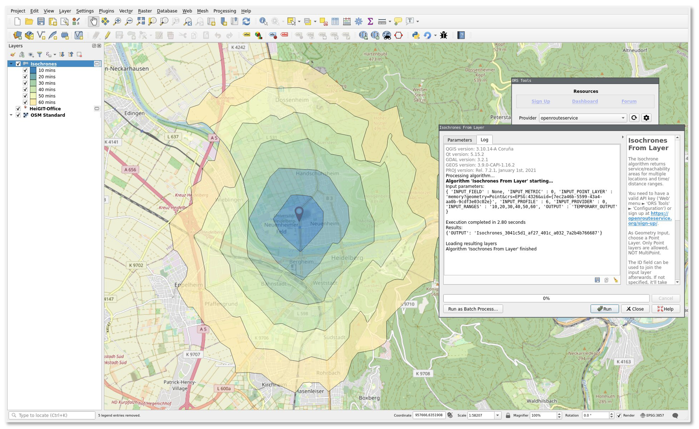

# The openrouteservice ecosystem

[comment]: # (|||)

There is a large **ecosystem of clients** which supports you to easily use and integrate openrouteservice into your project!

|                                         | Web Client | QGIS | Python | R   | JavaScript |
|-----------------------------------------|------------|------|--------|-----|------------|
| Integration via package/plugin possible |            | ✔    | ✔      | ✔   | ✔          | 
| Requires programming skills             |            |      | ✔      | ✔   | ✔          |
| Supports all ORS functions              |            |      | ✔      | ✔   | ✔          |
| Automatise bulk requests                |            | ✔    | ✔      | ✔   | ✔          |

[comment]: # (|||)

```{admonition} What if I need help?
:class: tip
If you have **questions or problems**, you will fine help in the [openrouteservice forum](https://ask.openrouteservice.org/). If you encounter **bugs**, feel free to create an issue in the respective [GitHub repository](https://github.com/giscience).
```

[comment]: # (|||)


## Web Client

Available at [https://maps.openrouteservice.org](https://maps.openrouteservice.org)  
GitHub: [https://github.com/giscience/ors-map-client](https://github.com/giscience/ors-map-client)

- Mobile friendly 
- Uses public ORS API
- Multi-language support
- **Functions:** directions, geocoding, isochrones and Points-Of-Interest search.

[comment]: # (|||)

</img>

[comment]: # (|||)

## QGIS

Available via the [QGIS Plugin Repository](https://plugins.qgis.org/plugins/ORStools/)  
GitHub: [https://github.com/GIScience/orstools-qgis-plugin](https://github.com/GIScience/orstools-qgis-plugin)

- Combine ORS with your own data ([Here is a nice tutorial](https://www.qgistutorials.com/en/docs/3/service_area_analysis.html). Thanks to [Ujaval Gandhi](https://twitter.com/intent/follow?original_referer=https%3A%2F%2Fwww.qgistutorials.com%2F&ref_src=twsrc%5Etfw%7Ctwcamp%5Ebuttonembed%7Ctwterm%5Efollow%7Ctwgr%5Espatialthoughts&screen_name=spatialthoughts)!
)
- No programming skills required
- Available in model builder 
- Enables processing in batch mode 
- Does not support all ORS endpoints and parameters

[comment]: # (|||)

</img>

[comment]: # (|||)

## Python

GitHub: [https://github.com/GIScience/openrouteservice-py](https://github.com/GIScience/openrouteservice-py)

- Response as Python objects
- Independent of API version

[comment]: # (|||)

**Installation** 

```
pip install openrouteservice
```

[comment]: # (|||)

**Calculate route**

```python
import openrouteservice
from openrouteservice.directions import directions

coords = ((8.34234,48.23424),(8.34423,48.26424))

client = openrouteservice.Client(key='') # Specify your personal API key
routes = directions(client, coords) # Now it shows you all arguments for .directions
```

[comment]: # (|||)

## R 

GitHub: [https://github.com/GIScience/openrouteservice-r](https://github.com/GIScience/openrouteservice-r)

```r
install.packages("devtools")
devtools::install_github("GIScience/openrouteservice-r")

your_api_key <- "YOUR_API_KEY"

origin <- c(6.943241, 50.334265)
destination <- c(7.119166, 50.548979)

normal_route <- ors_directions(list(origin,destination), api_key = your_api_key)
```

Conveniently supports geospatial classes in R like `sf`, `sp`, via the parameter `output=c("sf","sp","txt")`.

[comment]: # (|||)

## JavaScript 

GitHub: [https://github.com/GIScience/openrouteservice-js](https://github.com/GIScience/openrouteservice-js)

- Allows the integration of the openrouteservice API in your application 
- openrouteservice API validation 

[comment]: # (|||)

**Installation** 

`npm install openrouteservice-js --save`

[comment]: # (|||)

**Usage**

```javascript
import Openrouteservice from 'openrouteservice-js'

var isochrones = new Openrouteservice.Isochrones({api_key: "XYZ"});

isochrones.calculate({
    locations: [[8.67568,49.418477]],
    profile: 'foot-walking',
    range: [3600],
    interval: '600',
    range_type: 'time',
})
.then(function(response) {
    console.log("response", response);
})
.catch(function(err) {
    var str = "An error occurred: " + err;
    console.log(str);
});
```


 