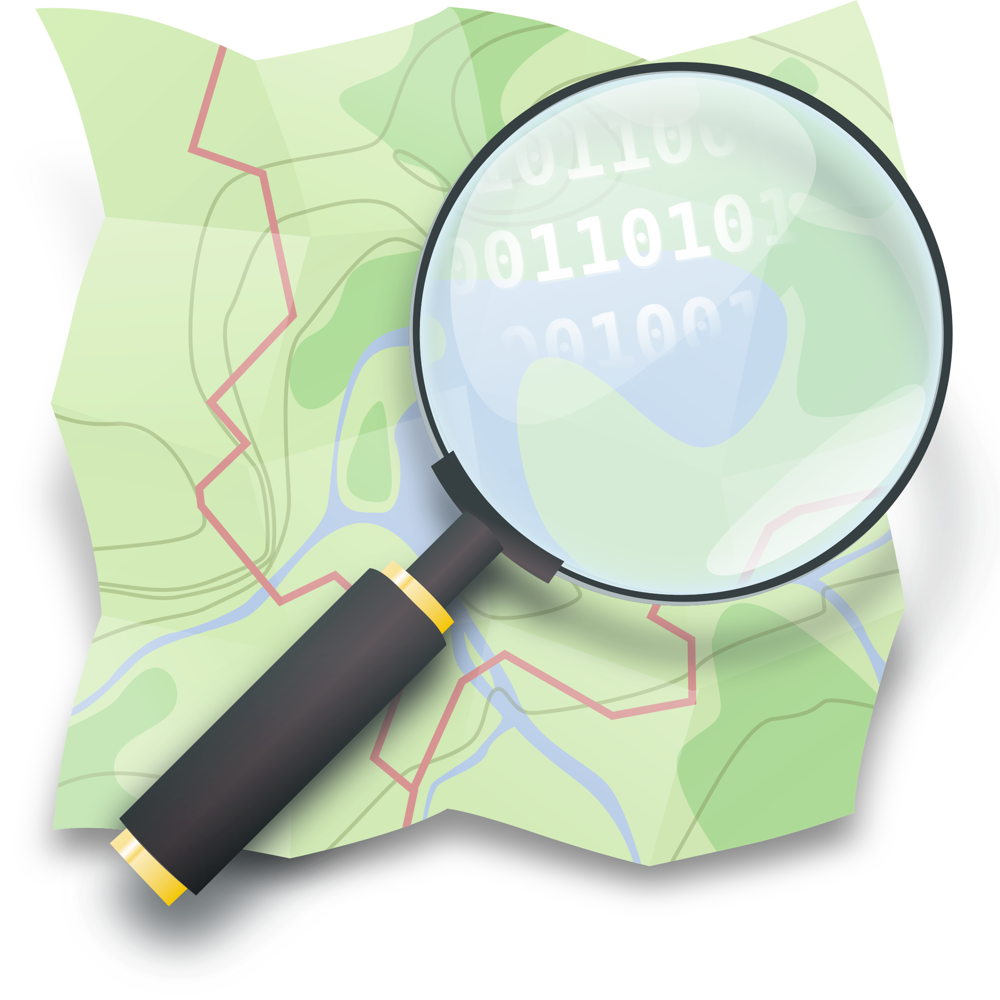
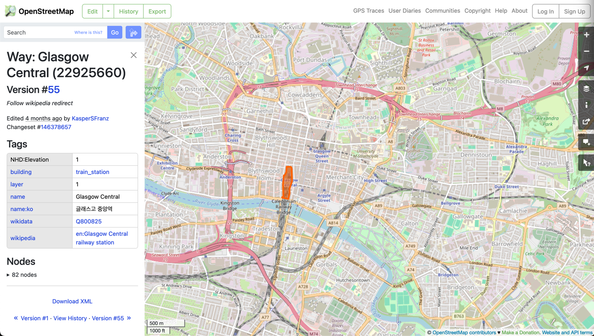
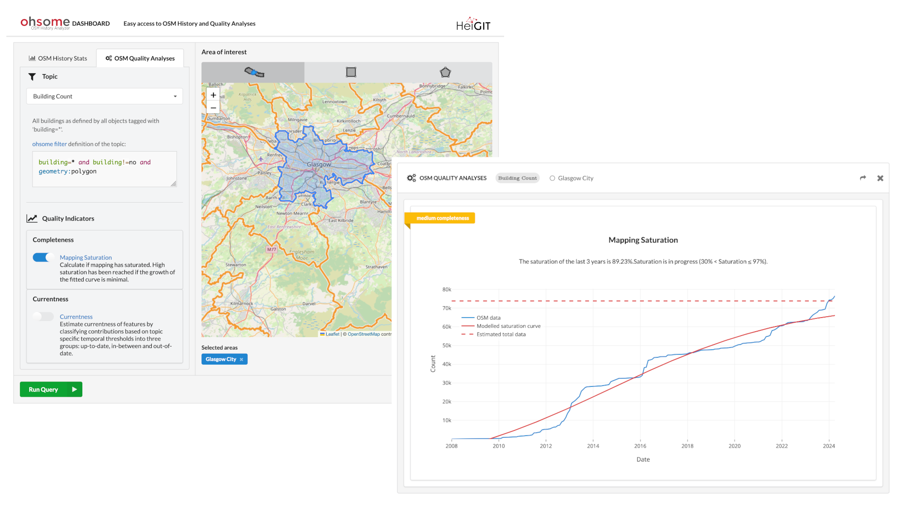

# OpenStreetMap

OpenStreetMap (OSM) is an open, editable, and free to use map of the entire world. Anyone with an account is free to 
edit information contained and so it has grown since it's creation in 2004 to a global dataset that can rival that of 
many authoritative providers. 

 

## How is data represented

Every piece of information contained within OSM is represented as a node, a way, or a relation. A node is the most 
atomic feature in OSM, and represents a single point. Ways are a sequence of OSM nodes which can be used to represent 
lines or polygons. Finally, relations are groups of nodes and ways that share a common relationship, such as bus stops 
making up a transit line.

What makes OSM really useful is that these geometric features and relations can have attributes attached to them in the 
form of "Tags". A tag is a simple key:value pair that represents some physical or conceptual attribute about the node, 
way or relationship that it is attached to. For example, a way that represents a road would have the tag 
`highway=primary` (if it was a primary road), and a node that represents an individual tree would have the tag 
`natural=tree`. Each feature can have any number of tags to better describe what it represents.

## How to access the data

In the most simplest form, you can see OSM data in the form of a web map at the OSM website (https://openstreetmap.org). 
If you want to use the data itself though, there are a large number of options to get hold of it. OSM provide weekly 
planet dumps which are single files containing all features and attributes in OSM (currently the compressed file is 
~75GB in size). Smaller subsets of data can be obtained from services such as GeoFabrik that provide individual OSM 
files at region, country or continental scales. If on the other hand you want filtered data, you can use the Overpass 
API and Overpass Turbo to get features of specific types and with defined attributes in an area. 

## The issue of "quality"

When talking about OSM data, one aspect that continually arises is the question of the quality of the data. Data 
quality itself is a very complex topic that is far too big to get into here, but in general several concerns arise due 
to the fact that anyone can contribute and edit data. On the one hand, that means that data can be of higher "quality" 
as people can add anything that is missing, but on the other hand it also means that people can add incorrect 
information, either accidentally or on purpose.

Another aspect relating to quality is that of "completeness". In this case, completeness refers to how much of the real 
world is mapped in OSM. In some areas the completeness is very high, often surpassing that of commercial and 
authoritative datasets, but in others it can be very low. There are several projects running that aim at improving 
completeness (such as [Missing Maps](https://www.missingmaps.org/)), especially in areas that normally are not well 
mapped in any other datasets.

So ultimately, the answer to the question "Is OSM data good enough quality" is completely dependent on the purpose, and 
there is no single and general answer. However, there are several tools that can help you make this decision, such as 
the [Ohsome Quality API (OQAPI)](https://heigit.org/big-spatial-data-analytics-en/ohsome/ohsome-quality-analyst-oqt/) 
which can be used to describe completeness of OSM data in specified areas.

