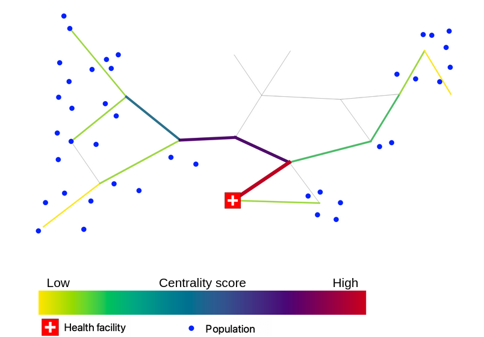

# Network analysis - Centrality

In the context of road routing, network centrality refers to the assessment of the significance and influence of specific road segments or intersections within a transportation network. 
It helps identify key routes or nodes that play a crucial role in connecting different locations, optimizing traffic flow, and enhancing overall accessibility and efficiency of the road network.
Openrouteservice supports the analysis of network centrality via an export endpoint. Users can obtain a weighted, directed graph representation of the OpenStreetMap road network. Options on the route type: fastest, shortest and routing profile are available to choose from. The exported graph can be used in other environments or tools to conduct further analysis, like centrality measures etc.

Usage in other software
* QGIS `Network Analysis`
* R with `sfnetworks`
* Python `NetworkX`

References:

* Petricola, S., Reinmuth, M., Lautenbach, S. et al. Assessing road criticality and loss of healthcare accessibility during floods: the case of Cyclone Idai, Mozambique 2019. Int J Health Geogr 21, 14 (2022). [https://doi.org/10.1186/s12942-022-00315-2](https://doi.org/10.1186/s12942-022-00315-2)
* Zia M, Fürle J, Ludwig C, Lautenbach S, Gumbrich S, Zipf A. SocialMedia2Traffic: Derivation of Traffic Information from Social Media Data. ISPRS International Journal of Geo-Information. 2022; 11(9):482. [https://doi.org/10.3390/ijgi11090482](https://doi.org/10.3390/ijgi11090482)
* Klipper, I. G., Zipf, A., and Lautenbach, S.: Flood Impact Assessment on Road Network and Healthcare Access at the example of Jakarta, Indonesia, AGILE GIScience Ser., 2, 4, , 2021. [https://doi.org/10.5194/agile-giss-2-4-2021](https://agile-giss.copernicus.org/articles/2/4/2021/)

## Closeness centrality

Closeness centrality is a measure that quantifies how easily a node in a network can reach other nodes, based on the inverse of the average shortest path distance from that node to all other nodes in the network.

* Determine the centrality of locations within a network based on efficient distance and time calculations for travel between different grid cell centroids in Rio.
* Grid-based analysis: Employed a 200m grid overlay on the city to divide the wider area into manageable units for analyzing mobility patterns and exposure
* Motorized and pedestrian routing profiles: Calculated travel distance and time for each grid cell centroid, considering both motorized travel and pedestrian routing options.
* Purpose: Developed an exposure layer to understand human mobility patterns, particularly relevant for assessing the spread of vector-borne diseases like Dengue fever in Rio.
* The analysis contributes to an exposure analysis by identifying individuals who may act as carriers of the disease, potentially getting bitten by a mosquito and infecting them, thereby aiding in disease prevention and control strategies.

## Betweenness and targeted centrality

Betweenness centrality is a measure that quantifies the importance or influence of a node within a network by assessing the extent to which the node lies on the shortest paths between other pairs of nodes. In other words, it captures how frequently a node acts as a bridge or intermediary in connecting different parts of the network.

* Graph representation: nodes & edges
* Directed  and weighed graph
* Betweenness centrality: Rank nodes/edges by their importance/influence for overall connectivity within the network (eg bridges, bridgeheads)

* Shortest path between all nodes
* Betweenness centrality score represents the amount of visits at every node/edge
* The more visits, the more central is a node/edge
* Limitation for specific analysis: 
  - _How important is a single road segment for commuting_
  - _How important is a single road segment for access towards healthcare_

* Modification: shortest paths between
  - Departure: all nodes
  - Destination: hospital

* Modification: shortest paths between all nodes and subset
  - Departure: all nodes
  - Destination: hospital
* Limitation: Biased towards roadnetwork density.

* Further modification: shortest paths between subset and subset
  - Departure: population centers
  - Destination: hospital

* Possibility to include population counts as weights
* Population density is not uniform
* Demographics 

---

* Research and paper publication conducted in 2021 on the influence of Cyclone Idai in Mozambique on the road network and access to healthcare facilities.
* Utilized targeted betweenness centrality to assess changes in centrality scores of road segments.
* Considered flooded areas as impassable and examined the impact on centrality.
* Used population centers as origins and healthcare facilities as destinations for centrality measurement.
* Identified roads that became more important for transportation towards healthcare services.
* Demonstrated the crucial role of these roads in facilitating access to healthcare during natural disasters.
* Highlighted the significance of targeted betweenness centrality in analyzing such scenarios.

By the way there is a Workshop at the GIScience Conference this year.
More info on the workshop: [giscience.github.io/giscience2023/](https://giscience.github.io/giscience2023/)

and on the conference:
[giscience2023.github.io/pages/workshop](https://giscience2023.github.io/pages/workshop.html)
