# Visualising walkability of routes in QGIS

In this part of the tutorial, we will look at how to use QGIS alongside openrouteservice to do some analysis relating to the bikability of areas.

## Required resources

* QGIS
* openrouteservice QGIS plugin
* Quick Map Services QGIS plugin
* openrouteservice API key (see resources section to get this)

## 1. Installing QGIS and the openrouteservice plugin

The first thing that you need to do if you haven't already is to install QGIS on your system. QGIS is an opensource GIS 
application that is available on many systems. You can find out how to install it on your system form the [QGIS 
installation pages](https://qgis.org/en/site/forusers/download.html).

When you have QGIS running, to make it easy to query openrouteservice you need to install the openrouteservice plugin.
This plugin is available on the global QGIS plugin repository, and is called "ORS Tools". To install it, use the 
following steps:

1. Open the Plugins Manager from the top menu Plugins -> Install and manage plugins

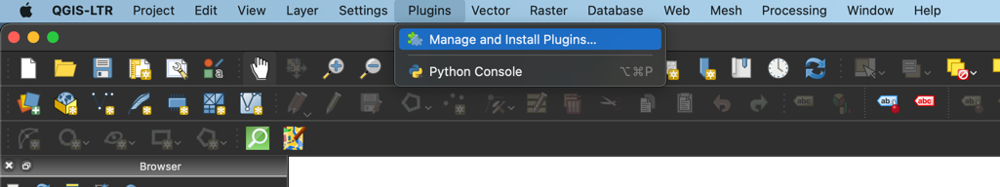

2. This will bring up the Plugin manager window (after refreshing the repo listings). In the search bar, enter "ors 
tools", select the "ORS Tools" plugin, and click "Install Plugin" (bottom right of the window). This will install the 
plugin into your QGIS environment.

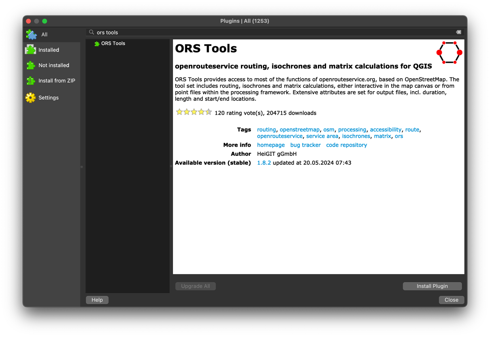

3. To make understanding the data easier, we will also install the "Quick Map Services" plugin. You do this the same as 
for the openrouteservice plugin, but search and select the "QuickMapServices" plugin.

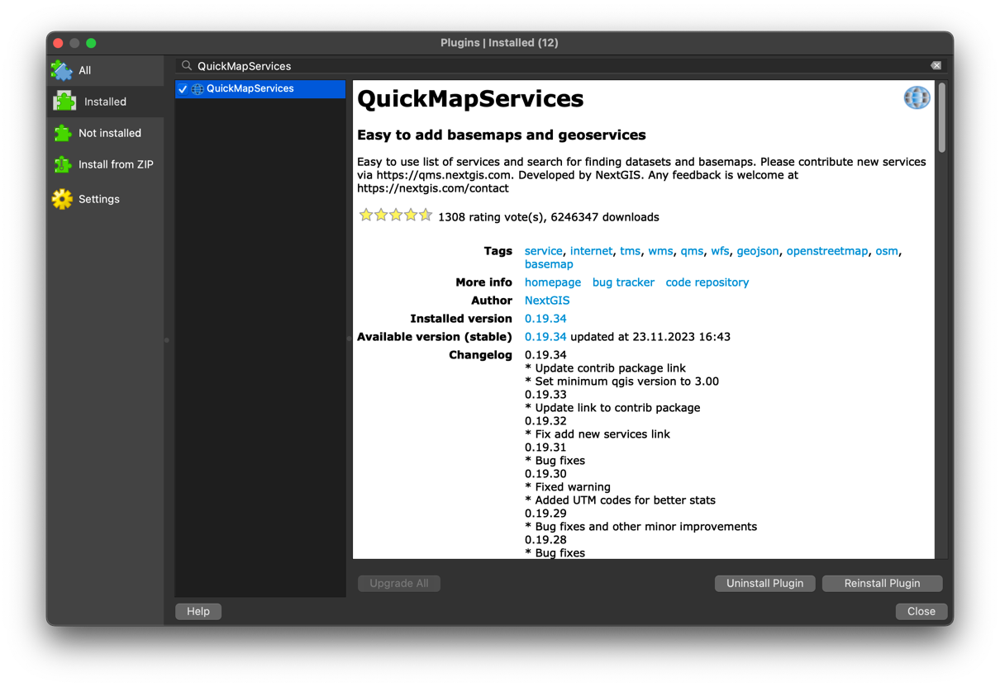

## 2. Setting up the ORS Tools plugin

Before you can use the ORS Tools plugin properly, you need to do some configuration to allow it to communicate with 
an openrouteservice instance. In our case, we have setup a special public instance that can be accessed with the API 
key which can be downloaded from the resources section of this tutorial.

To configure a "provider", navigate to the Web -> ORS Tools -> Provider Settings menu.

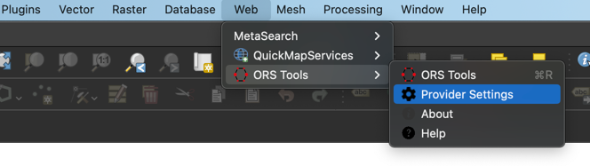

This will open up the Provider Settings window. We need to add a new provider by clicking on the "Add" button (lower 
left corner) which will then prompt you for a name. Let's call this provider "agile conference openrouteservice". 
After clicking "OK" you will now see the Provider Settings window again, but this time showing the text boxes to 
enter information for the new provider. For the Base URL, you need to enter `https://api.openrouteservice.org/agile-conference` 
and the API key that you can find in the resources section. You can leave the Request timeout as the default value 
of 60. Once you have entered this information, click on Save to store it ready for use when you come to doing some 
routing. 

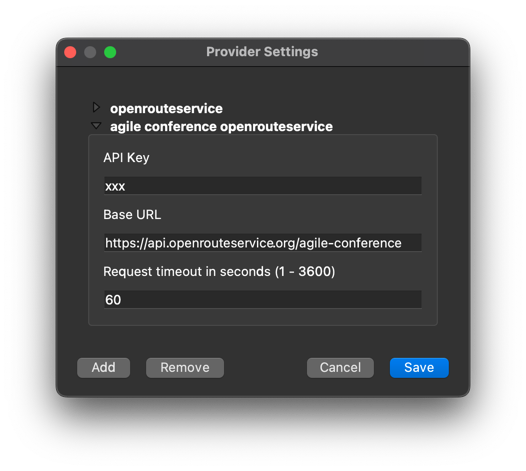

## 3. Doing some routing

Now that we have all the plugins and setups needed, we can start actually producing some routes. To start off, it would 
be good to actually know where we are doing routes to and from. As openrouteservice is based on OSM data, it is good to 
have a map available that corresponds to that data. Luckily, we have already installed a plugin that allows you to show 
the OSM data as a base map - the QuickMapServices plugin. To load that OSM data, you need to use the QuickMapServices 
plugin top menu, so Web -> QuickMapServices -> OSM -> OSM Standard. This loads the OSM data as a raster base map in 
QGIS.

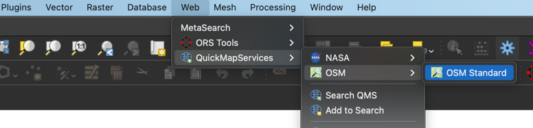

The openrouteservice setup that we will use for this tutorial contains road data for Scotland, so we need to make sure 
that our routes that we want to generate are in scotland. In this tutorial, we will focus on Glasgow, but feel free to 
also do things in other places in Scotland.

The bread and butter of the ORS Tools plugin is to allow you to generate a route between two points by querying the 
public openrouteservice API. When you load the plugin through the Web -> ORS Tools -> ORS Tools menu (or by clicking 
on the plugin's icon in the toolbar), you will get the main window for the plugin:

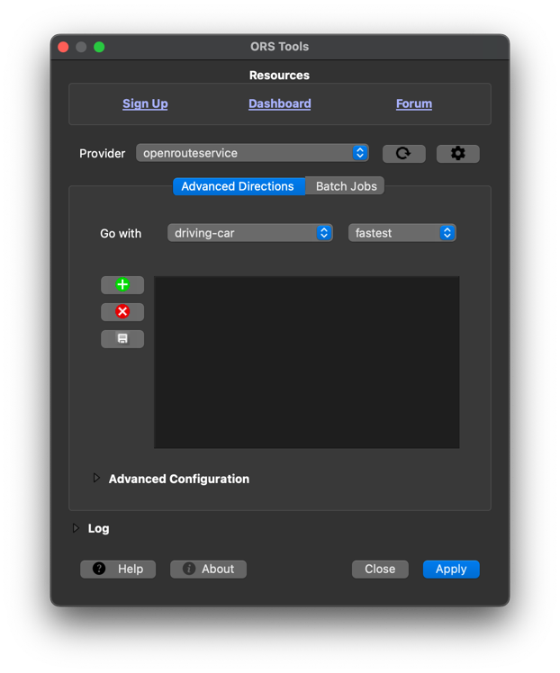

At the top of this window you will find some links to useful online resources such as the Ask forum which is a great 
place to go to if you have a question or problem relating to using this plugin or any other aspect of 
openrouteservice. Next is the provider area where you select where you want to send your routing queries to. In an 
earlier stage of this tutorial, you already added a new provider which sends requests to the special routing 
instance setup for this tutorial. By default, the standard public openrouteservice provider is selected, but you can 
choose another one that has been configured by clicking on the current provider to bring up a list. So let's go 
ahead and already select the "agile conference openrouteservice provider". Next up is where you select routing 
options. As a very first example, we will stick with the "Advanced Directions" (we will sue the "Batch Jobs" area in 
a later step). The next drop downs allow you to select a routing profile, and the preferred type of route. In the 
scotland instance we have setup, there are only foot-walking and cycling-regular available, so let's select 
"cycling-regular" and the preference to "shortest". This will add information to the request sent to the special 
instance that tells it to to a normal bike route, and focus on getting the shortest route possible.

We now have the basic settings, so let's select our start and end points for the route. For this example, let's do a 
route from the university to the main train station in Glasgow. To add the points, click on the green "+" button 
which will hide the plugin window and move you back to the main QGIS window. To choose you points, click roughly 
where the university is to set the start point, and then double click around the train station to set the end point 
(if you single click, it will add a via point rather than specifying the end point). The following image shows 
roughly where to place these points:

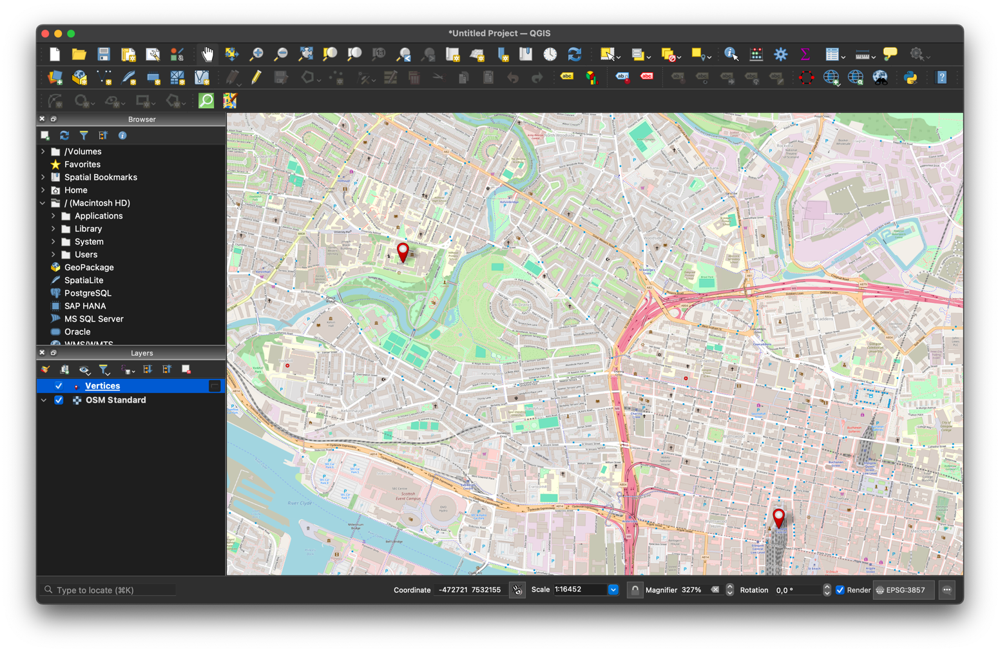

After you double click to set the end point, you will be returned to the ORS Tools window and you can see the 
vertices in the list. If you accidentally added a via point or got another point in the wrong locations, you can 
delete it by selecting the point in the list, and then clicking the red "x" button. If you have not selected a point 
in the list, clicking this button will clear all the points in the list. To make things easier in later stages, you 
should click on the "Save Points" icon (under the "Delete Point" button) which will add the points to QGIS as a 
point layer called "Vertices".

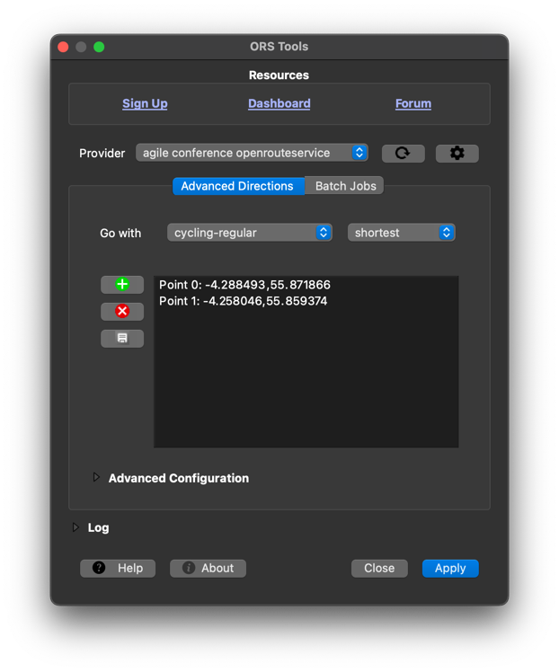

Now that all the information is added, you can click on "Apply" and you should get the shortest bike route between 
these two points added to QGIS as a layer. If there was an error displayed, make sure that you have selected the 
correct provider, that ti is configured correctly (with the API key from resources), and that you have selected 
"cycling-regular" and "shortest".

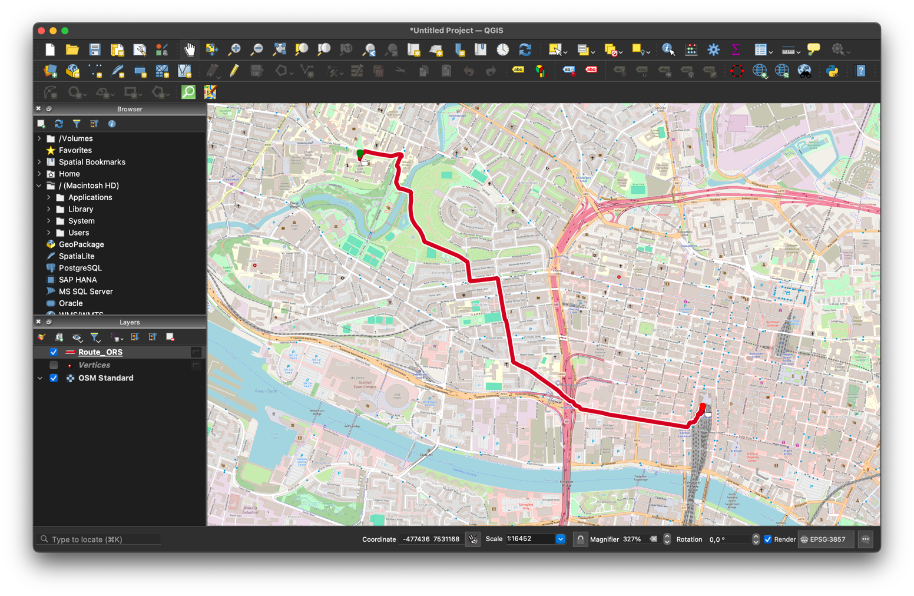

So there we are, you now have a route in QGIS. If you open the attribute table for this layer, you will see that the 
feature has information about how long it is, and the estimated amount of time needed for the journey. It is a good 
idea to change the name of the layer to something more meaningful, so let's call it "bike shortest standard" (by 
right clicking on the layer and choosing "Rename Layer").

## 4. Reachability

Reachability refers to how far you can get from a specified point in either distance (isolines) or time (isochrones).
This sort of analysis is particularly useful if you want to determine things such as service area for facilities 
like subway stations. For our example, we will look at a basic visualisation of how far you can get from the central 
train station by foot in specified times.

To start, open up the ORS Tools plugin, and this time click on the "Batch Jobs" button. This will hide the point 
list area and instead bring show some buttons for doing some more advanced analysis. 

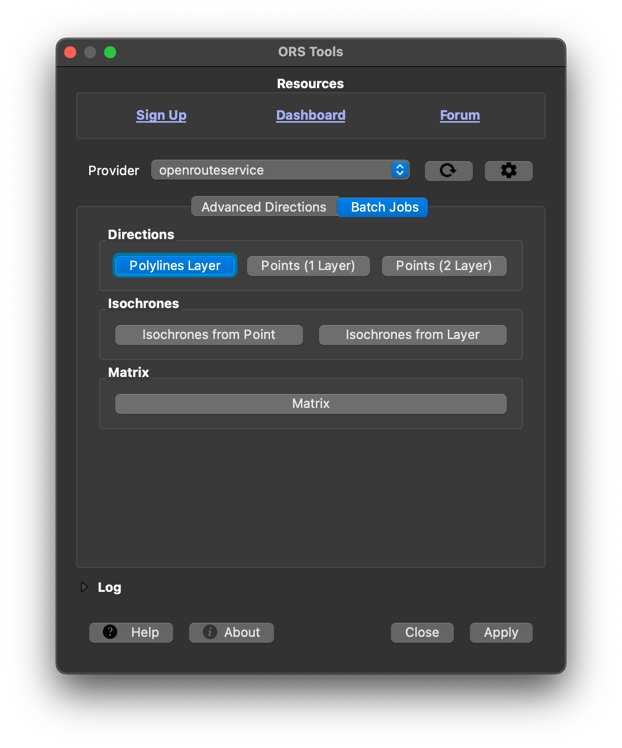

From these buttons, click on "Isochrones from Point" to open a second ORS Tools window where you set parameters for 
doing reachability analysis. In this window, select the "agile conference openrouteservice" as the provider, and 
"foot-walking" as Travel mode. Click on the three dots by the "Input point from map canvas" entry and then go to the 
main QGIS window where you can click on the map to set the starting point for the reachability analysis. For us, 
let's again click on the main train station in Glasgow. This will add the coordinates to the text box under teh 
"Input point". Next, make sure that "Time" is selected under Dimension (so that we do reachability based on time) 
and then enter the duration of travel in the "comma seperated ranges" box. This text fields accepts multiple comma 
seperated value that represent either time in minutes, or distance in metres. We want to see how far people can get 
from the station in 10, 20 and 30 minutes, so enter "10,20,30" in this box. Leave location type and advanced options 
as is, and then click on "Run". 

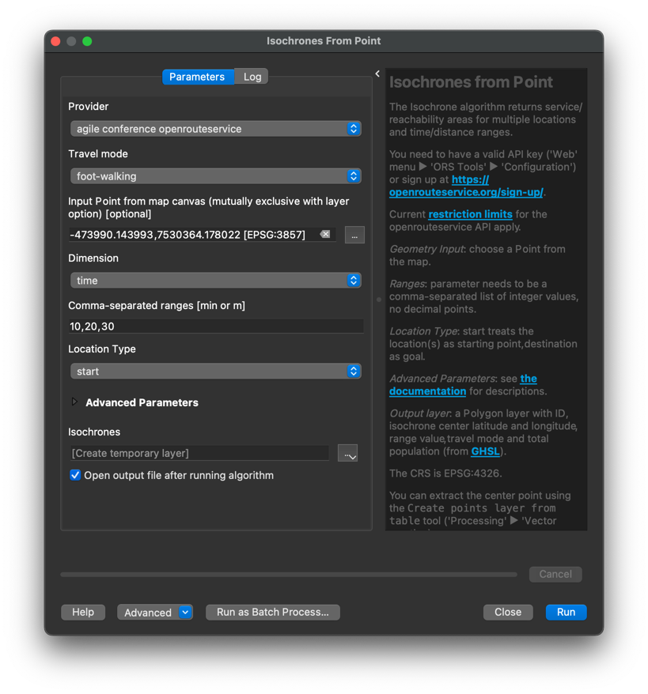

This will add the isochrone to QGIS as a layer, with polygons representing how far you can get in 10, 20 and 30 
minutes by foot from the train station.

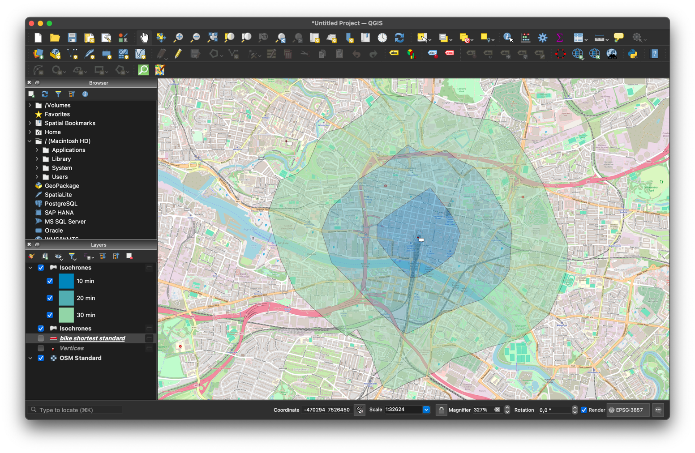

## 5. Assessing bikability

Int he final part of this tutorial section, we will use the ORS Tools plugin to derive some information about the  
bikability of routes. 

In the special instance of openrouteservice provided for this tutorial, bikability has been included from NetAScore 
for all ways in Scotland. As discussed in the "openrouteservice" part of this tutorial, this information is stored 
on the routing graph and can be used to alter how much a particular way is avoided in routing. For this example, we 
will stick with the route between the university and main train station in Glasgow.

To start with open up the ORS Tools plugin and navigate to teh Batch Jobs area. Once there, select the "Points (1 
layer)" button from teh Directions section to open up the advanced routing window. There are a number of settings 
here that you need to change to be able to do routing that takes into account bikability, but lets start by setting 
the provider to be the "agile conference openrouteservice", Travel Mode to "cycling-regular" and Travel preference 
to be "shortest". For "Input", click the box and select the layer that we earlier created by saving the start and 
end points form the basic routing generation (it should be called "vertices" unless you changed it). That is enough 
to be able to generate a route, but to do bikability, we need to scroll down and expand the "Advanced Parameters" 
section which will show some options that can be added to routing requests. Of relevance to this example, we need 
the "Extra Info", "Csv Factor", and "Csv Column" parameters. "Extra Info" is a list of attributes about the 
underlying features that make up a route which are then returned alongside the route geometry in an encoded format. 
Csv Column is the weighting value that we want to apply to ways of the route so that they are avoided more than they 
normally would be. Csv factor is a decimal value between 0 and 1 that defines how much effect the weighting factor 
has on the route generation itself, with 0 meaning there is no effect and 1 meaning that it has the highest level of 
effect as possible.

To start with, from Extra Info select "csv", set "Csv column" to be "index_bike", and "Csv factor" to be 0. This 
will result in the same shortest route as before as we are telling it that the weighting has no effect. However, 
having this information is important when we want to get the extra info about the bikability (the csv extra info 
needs to know which weighting to return).

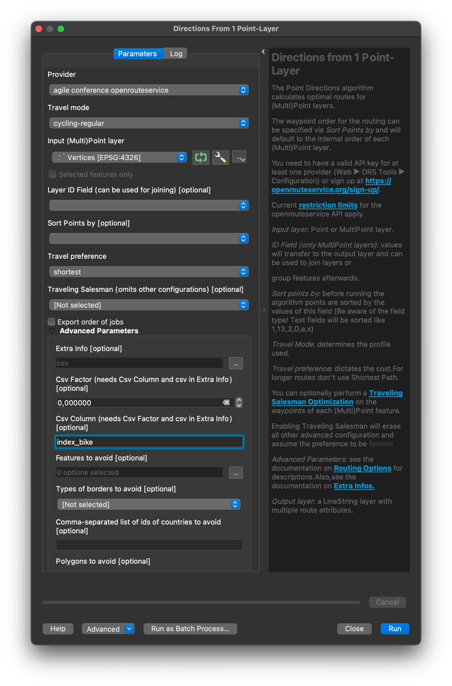

When you click on "Run" you should then have the resulting route added to QGIS as a layer (Note: the route is 
displayed as a simple line which may be difficult to see against the OSM background map). Though this route is the 
same as the shortest route that we generated earlier, if you look into the attribute table you will see that rather 
there being one entry containing information about the route, there are a number of entries and a column called 
"CSV". These entries represent segments of the route that have different values from the csv extra info, in our case 
these values represent the bikability of the route. One important thing to note here is that the numbers go from 0 
to 100, where 100 represents parts of the route that are not bikable, and 0 represents those that are very bikable. 
To visualise this information, let's change the symbology of the layer by right clicking on teh layer in the Layers 
panel and selecting "Properties". Navigate to the "Symbology" tab, and select "Graduated" from the drop down at the 
top of the window. Now select "CSV" as the "Value" and choose a suitable colour ramp. As we know that 0 is bikable 
and 100 is not bikable, you could select the "Spectral" colour ramp, adn then choose to invert it so that higher 
values are seen as red. Now select an "Equal Interval" Mode with 5 Classes, and click the "Classify" button. This 
will create 5 equally sized classes that will then be used to show the information.

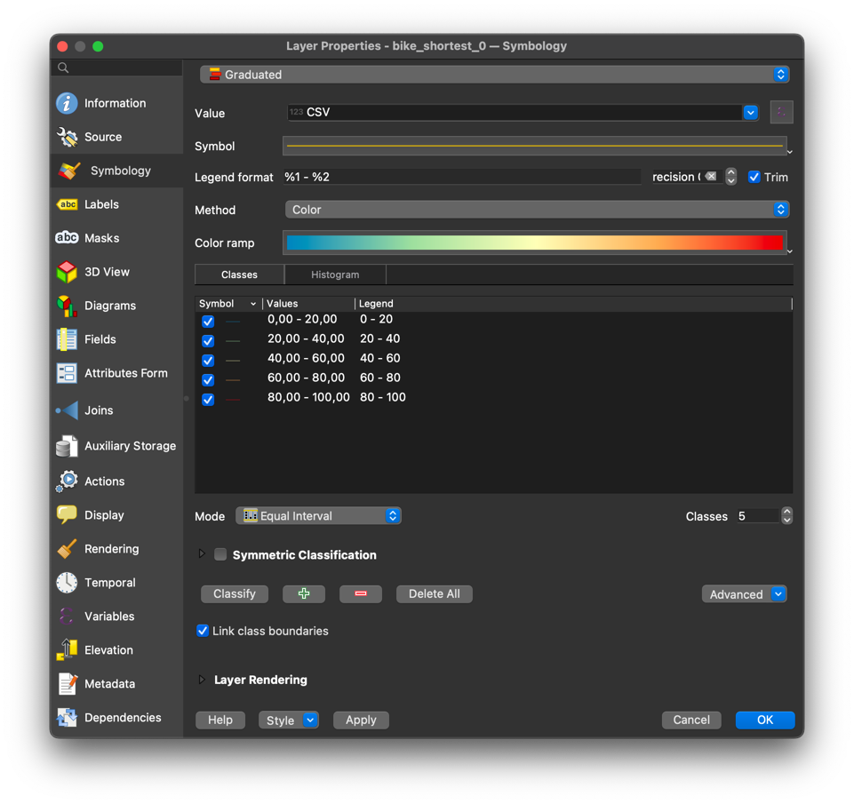.

Once you have changed these settings, click "OK" to change the symbology of the route. If the lines are too small to 
see well, you can go back to the symbology settings, click on the "Symbol" area near the top of the window, and 
change the width of the line. You can also change the transparency of the background map by right clicking the "OSM 
Standard" layer, selecting properties, going to the "transparency" tab and then using the slider to reduce the 
opacity. Now you are able to see the bikability of the sections of the route.

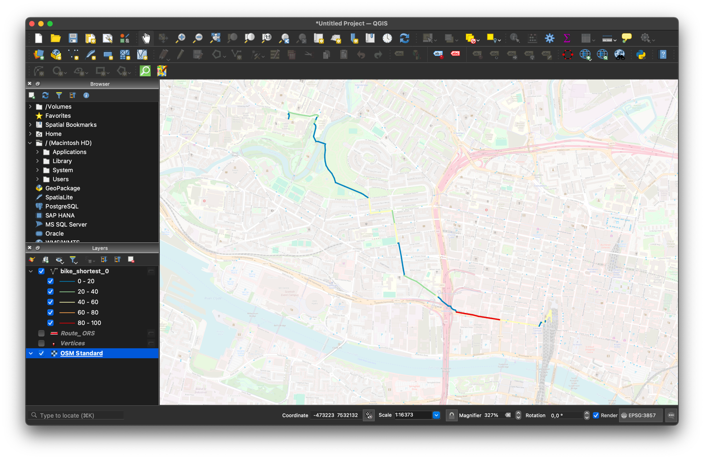

Now what does a route look like where we tell it that we want a more bikable route. To see this, follow the above 
steps, but this time set the Csv Factor value to be 1. What we see in the resultant route is one that avoids the 
areas in the original route that were seen as low bikability.

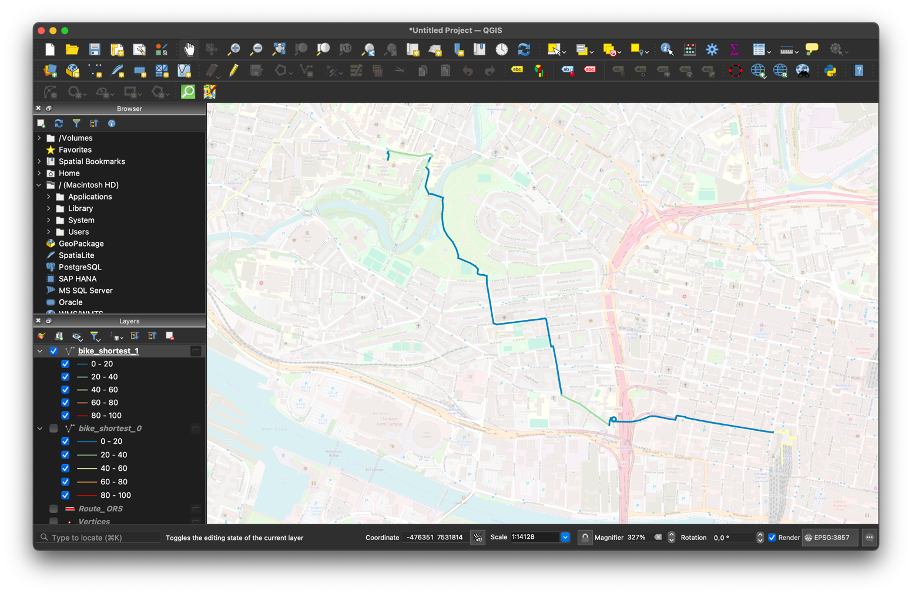

If we want to see the difference in length and travel time, we need to rerun the above steps, but **not** select the 
csv option in the Extra Info area. This will result in the route being returned as a single line with the duration 
and length attributes attached. When we look at the two routes, we see that the route that doesn't take into account 
bikability is 3.2km long and takes approximately 14 minutes to traverse, whereas the more bikable route is 3.4km 
long and takes almost 15 minutes. Though over these shorter distances, it may be preferable to take the slightly 
longer route that is more bikable, in others, the difference might be too great.

Do some analysis by multiplying segment length by bikability and then getting the average for each route
