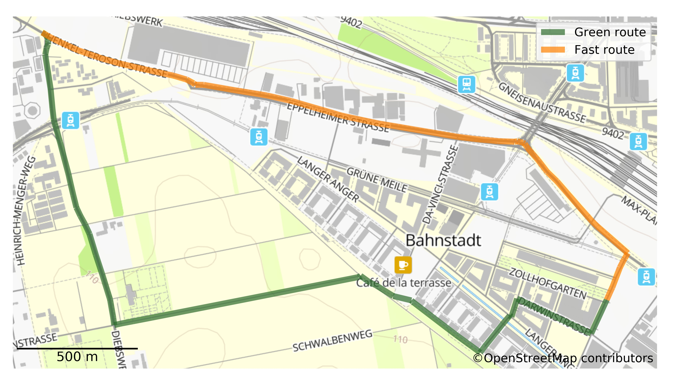

# Healthy Routing

For pedestrians and cyclists, the fastest route is not always the best, since factors such as traffic, road infrastructure or their surroundsings play a much bigger role than for car driver. Therefore, we are researching and developing specialised routing profiles which give better and healthier route suggestions especially for vulnerable groups such as the elderly or children. 

## Green and noise avoiding routing 

The green routing suggests routes which preferably lead alongside vegetation such as parks or residential gardens, while keeping the detour to a minimum. The same has been done to avoid loud streets due to high traffic. 

</img>

To get a green instead of the fastest route, a green index is derived for each street segment. This index is combined with the length of the road to adjust the cost function using the routing algorithm to find the best route. 

</img>

## Heatstress avoiding routing 

Due to climate change, heat stress is and will continue to be a growing problem in cities. In the [HEAL project](https://www.geog.uni-heidelberg.de/gis/heal_en.html), we are developing a routing service which suggests routes for pedestrians which avoids places with large heat stress based on real-time sensor measurements in the city.    

</img>

