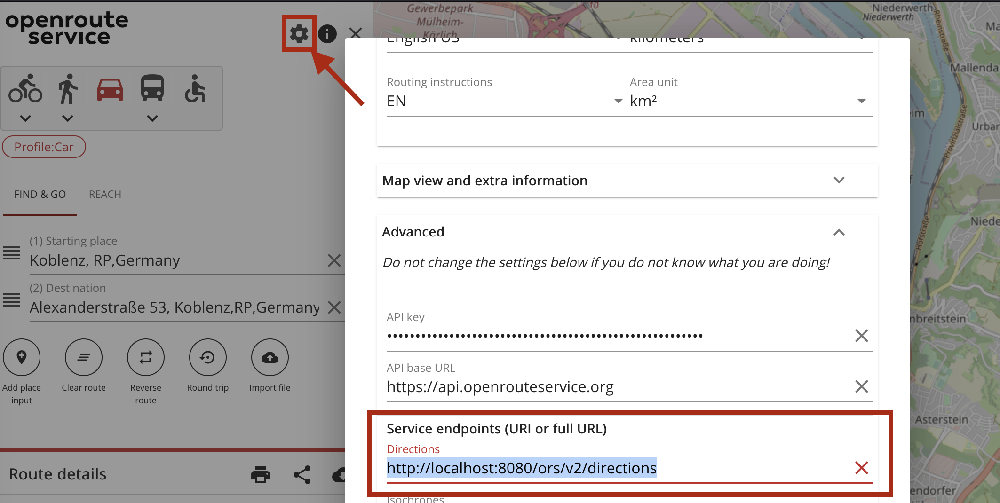

# Setting up openrouteservice locally via docker: A step-by-step guide

This document will walk you through all the necessary steps, from installing Docker on your system to configuring and customizing the OpenStreetMap (OSM) data source, enabling you to run your own local instance of OpenRouteService. By following this guide, you will gain hands-on experience in deploying and utilizing OpenRouteService for your specific routing and geospatial analysis needs.


* Openrouteservice github repo: [github.com/GIScience/openrouteservice](https://github.com/GIScience/openrouteservice)
* Running with docker documentation: [giscience.github.io/openrouteservice/installation/Running-with-Docker.html](https://giscience.github.io/openrouteservice/installation/Running-with-Docker.html)
* Advanced docker setup: [giscience.github.io/openrouteservice/installation/Advanced-Docker-Setup](https://giscience.github.io/openrouteservice/installation/Advanced-Docker-Setup)
* Openrouteservice wiki: [github.com/GIScience/openrouteservice/wiki](https://github.com/GIScience/openrouteservice/wiki)


## Setup of docker

Install docker and docker-compose on your machine
* Linux, via apt: [https://www.theserverside.com/blog/Coffee-Talk-Java-News-Stories-and-Opinions/How-to-install-Docker-and-docker-compose-on-Ubuntu](https://www.theserverside.com/blog/Coffee-Talk-Java-News-Stories-and-Opinions/How-to-install-Docker-and-docker-compose-on-Ubuntu)
* Mac: [https://docs.docker.com/desktop/install/mac-install/](https://docs.docker.com/desktop/install/mac-install/)
* Windows: [https://docs.docker.com/desktop/install/windows-install/](https://docs.docker.com/desktop/install/windows-install/)

You can run openrouteservice on all of the mentioned operating systems. This tutorial however is especially catered towards linux (ubuntu/debian) users. Some commands may won't work. However every command's action is described in order to translate it onto another OS.

Download the docker-compose.yml from openrouteservice github here: [github.com/GIScience/openrouteservice/blob/master/docker-compose.yml](https://github.com/GIScience/openrouteservice/blob/master/docker-compose.yml)

## Initial startup of your instance

Make sure to create the following folders first with the command below. This is necessary to run the docker as a local user instead of a super user.

```
mkdir -p docker/conf docker/elevation_cache docker/graphs docker/logs/ors docker/logs/tomcat
```


Start up your ors docker instance via the command:

The two parameters are in place to run the container as local user instead of a super user.
```sh
ORS_UID=${UID} ORS_GID=${GID} docker compose up
```

Monitor the log in your command line interface and check 
http://localhost:8080/ors/v2/health 

As soon as the response is healthy: ok, the graph is built and your openrouteservice instance is ready to accept requests.

You can check which profiles are built behind this endpoint:
http://localhost:8080/ors/v2/status

The standard OSM dataset to be used when first starting contains Heidelberg, Germany only. Therefore now we change the data source to Kosovo.

## Prepare your pbf


Get a .pbf of Kosovo from [geofabrik.de](https://www.geofabrik.de)


```
wget http://download.geofabrik.de/europe/kosovo-latest.osm.pbf
```

**Be aware that the size of the pbf file determines the time your instance will need to startup/built the graph and how much RAM it will use while running**

Kosovo is not too large, so on a recent computer it should not take more than 10 Minutes to startup.

If the preprocessed pbf files by geofabrik don't suit your area of interest, consider the usage of `osmium` to extract a custom region by a bounding box.

More info on the software and usage:
[docs.osmcode.org/osmium/latest/index.html](https://docs.osmcode.org/osmium/latest/index.html)

Now, we have downloaded and prepared our kosovo pbf file. 
Next, we alter the docker compose and point it to our pbf file to load it while starting up to built te graph. Change the following lines in the `docker-compose.yml`.


Line 21 from `#- ./your_osm.pbf:/home/ors/ors-core/data/osm_file.pbf` to `- ./kosovo-latest.osm.pbf:/home/ors/ors-core/data/osm_file.pbf`

Line23 from `BUILD_GRAPHS=False` to `BUILD_GRAPHS=True`


## Use your local instance with an customized AOI

Great we have downloaded a custom pbf files and defined the right location in the docker-compose file. Now restart your docker:

```sh
ORS_UID=${UID} ORS_GID=${GID} docker compose down
ORS_UID=${UID} ORS_GID=${GID} docker compose up
```

Again, check the logs and health status.

## Use your local docker instance

If the health and status endpoints look good, your instance ready to accept requests at `http://localhost:8080/ors/v2/`.

You can now use all available clients of openrouteservice. You only have to change the configs to make requests against your local instance instead of the public one.

* **QGIS**: Open the ors tools interface and click on the gear button. Provider settings appear. Go ahead and click add. Now put in a identifier for your local endpoint and its address: `http://localhost:8080/ors/v2/`. Now when you use openrouteservice tools in QGIS, you can choose between pulic and local providers
* **R**: Set the endpoint with: `options(openrouteservice.url = "http://localhost:8080/ors")`
* **Python**: Set the endpoint with: `client = openrouteservice.Client(base_url='http://localhost/ors')`
* **JS**: Set the endpoint with: `let orsDirections = new Openrouteservice.Directions({ host: "http://localhost:8082/ors" }`
* **Web client**: Open the [ORS web client](https://maps.openrouteservice.org). Open the settings using the button located at the top right of the side menu. Open the 'Advanced' tab and in section 'Service endpoints (URI or full URL)' replace the field 'Directions' with your local one: `http://localhost:8080/ors/v2/directions`. Click 'save' and you are good to go!

    </img>

* **classic-webclient**: Access the classic-webclient [here](https://classic-maps.openrouteservice.org/directions?n1=49.413207&n2=8.701944&n3=13&b=0&c=0&k1=en-US&k2=km). Click on the small gear button located at the top right of the left navigation bar. Again click on the very light grey gear symbol on the bottom left(hard to see, just try to hit it somewere there). Developer Options appear. Change the BaseUrl to your local one: `http://localhost:8080/ors/v2/`. Click on change Endpoints. You are good to go!

You can save this config to cookies to make the change persistent when you leave the website and come back later, otherwise it will be resetted to the requests against the public API. Just tick the box next to the Change Endpoints button.


## Alter the ORS config file

By default only car profiles are activated.
Edit the config file located at `docker/conf/ors-config.json` 


Add "walking" in the array `active` in line 119:

```
"init_threads": 1,
"attribution": "openrouteservice.org, OpenStreetMap contributors",
"elevation_preprocessed": false,
"profiles": {
  "active": [
    "walking"
  ],

```
If you are interested in cycling and car profiles you can add "bike-regular" and "car" as well separated by a comma.

You find a thorough documentation of the config file and its options in the wiki here [https://github.com/GIScience/openrouteservice/wiki/Configuration-(app.config)](https://github.com/GIScience/openrouteservice/wiki/Configuration-(app.config)).

After you altered the config file, restart your docker instance as before when we changed the pbf file.


